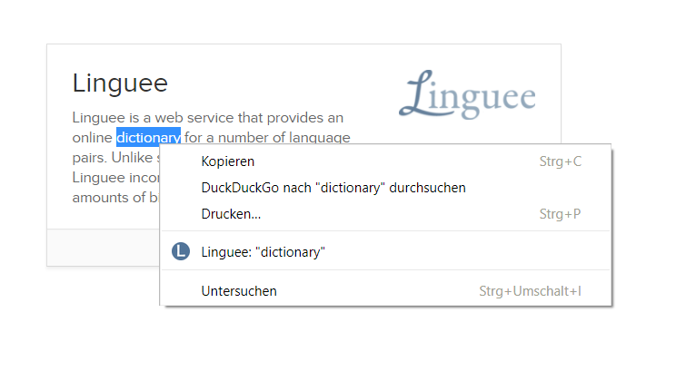

# Unofficial Linguee Chrome plugin

An unofficial chrome plugin witch provides a context menu for easy [Linguee](https://www.linguee.com/) searches.

## Installation

1. Clone/Download this Repository
2. Visit `chrome://extensions` in your browser or select **Extensions** under the **More Tools** menu.
3. Ensure that the Developer mode checkbox in the top right-hand corner is checked.
4. Click **Load unpacked extension...** to pop up a file-selection dialog.
5. Navigate to the directory of the repository, and select it.

**Alternatively**, you can drag and drop the repository directory onto `chrome://extensions` in your browser to load it.

## Credit

Without this [StackOverflow][answer] answer by Bartłomiej Szałach, I would have never been able to write this plugin. Mostly, because I distaste "Web Development".

[answer]: https://stackoverflow.com/questions/13783500/context-menus-in-chrome-extensions#13783536
